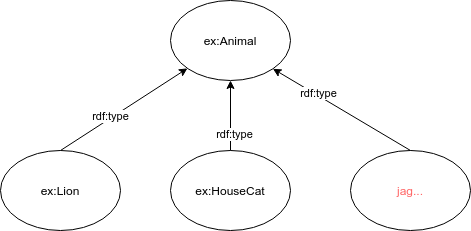

Neologism Recommender
=====================

This repository contains the recommender used for neologism2. It is used for both class and property recommendations.

Recommending classes
---------------------

* Classes are recommended based on a search string and a serialization of the graph in which the class occurs (the context)
	* Currently, that context is only used for some recommenders
* The request is dealt with by multiple internal recommenders that can:
	* Search in local vocabularies 
	    * (DCAT and Dublin Core are pre-configured)
	* Proxies the query to bioportal http://data.bioontology.org/documentation#nav_recommender
	* Proxies the query to the LOV recommender https://lov.linkeddata.es/dataset/lov/api/v2 
	    * Currently term/search is used. Likely term/autocomplete is also a good option
	* Query a given SPARQL endpoint to see whether there are classes used there that contain the search string
        * We use a triple store located on an internal server for this. This can be configured.

It is also possible to add more proxies, more local vocabularies, and more endpoints.

Now, these different backend recommenders have different speeds. The local vocabulary recommender precomputes all answers iand is hence near instant. Others take longer. To get quick results for the application using this system a couple of measures are taken:

Results are cached, also the context is cached so that things do not have to get parsed again.
REquests will timeout if downstream recommenders are too slow.

Results are provided in chunks. this works as follows:
* First request:
    * `/start/`
        * parameter: model (see below)
        * Example request: http://localhost:8080/recommender/start/?model=%40prefix%20ex%3A%20%3Chttp%3A%2F%2Fexample.com%2F%3E%20.%0Aex%3ALion%20a%20ex%3AAnimal%20.%0Aex%3AHouseCat%20a%20ex%3AAnimal%20.%0A%3Cneo%3A%2F%2Fquery%2Fjag%3E%20a%20ex%3AAnimal%20.%0A
        * This returns a json obect with 
            * and ID: `ID`
            * a first part of the recommendations `recommendation`
            * how many more parts are to be expected `expected`
            * a variable `more` indicating wheter more is yet to come.
        * the recommendation itself contains recommendation objects. Each of these has:
            * labels and comments(including language tags)
            * `URI` the identifier of the recommended class
            * `ontology` an indication of the vocabulary from which this is sourced
        * the recommendation also contains a creator. This can be useful later when requesting properties for the the class
        * For example:

        {
        "ID":"7E09404FF6EB45603F6171ED509A26B3",
        "recommendation":{
            "list":[
                {
                    "labels":[
                    {
                        "language":"en",
                        "label":"Dataset"
                    }
                    ],
                    "comments":[
                    {
                        "language":"en",
                        "label":"Data encoded in a defined structure."
                    }
                    ],
                    "URI":"http://purl.org/dc/dcmitype/Dataset",
                    "ontology":"DCAT"
                },
                {
                    "labels":[
                    {
                        "language":"en",
                        "label":"Dataset"
                    }
                    ],
                    "comments":[
                    {
                        "language":"en",
                        "label":"A collection of data, published or curated by a single source, and available for access or download in one or more formats"
                    }
                    ],
                    "URI":"http://www.w3.org/ns/dcat#Dataset",
                    "ontology":"DCAT"
                }
            ],
            "creator":"de.rwth.dbis.neologism.recommender.localVoc.LocalVocabLoaderDCATa49e3f1372ec6d12368e17cdd3c53698"
        },
        "expected":4,
        "more":true
        }

* Next, a subsequent requests can be performed to get the remaining results
    * `/more/` 
        * parameter: ID - the ID as provided in the answer to `/start/`.
        * Example request: http://localhost:8080/recommender/?ID=7E09404FF6EB45603F6171ED509A26B3
        * this returns a JSON object containing a recommendation as above if there are still any left and an indicator `more` indicating whether there is more to come.

###Input to the recommender###

The *model* parameter

The recommender expects two pieces of information. The searchstring and a serialization of the graph in which the class occurs (the context)
    * the model is a serialized graph in turtle format. 
    * The place in the graph were the node occurs has the special form `<neo://query/searchstring>` where searchstring is replaced by the recommenderInput input

For example, given the following graph, where the recommenderInput is askign a recommendation for the string "jag"

</img>

The graph send to the recommender can be serialized as:

    @prefix ex: <http://example.com/> .
    ex:Lion a ex:Animal .
    ex:HouseCat a ex:Animal .
    <neo://query/jag> a ex:Animal .

Note that we use turtle serialization, so we can write `a` instead of `rdf:type`.
The query string is embedded in the graph. As in a normal RDF graph serialization, it could occur multiple times if more relations are defined.
If used as a GET request, the graph needs to be URL encoded: %40prefix%20ex%3A%20%3Chttp%3A%2F%2Fexample.com%2F%3E%20.%0Aex%3ALion%20a%20ex%3AAnimal%20.%0Aex%3AHouseCat%20a%20ex%3AAnimal%20.%0A%3Cneo%3A%2F%2Fquery%2Fjag%3E%20a%20ex%3AAnimal%20.%0A

In case the class is not yet connected to anything in the graph, it is also possible to send the model and the searchstriong separately.
For this case, the model argument is provided as a POST body. For the normal request, this is not implemented, yet.

Internals
---------

* Currently comments and labels with non-english language tags are filtered out right before the answer is send to the client.

OLD NOTES BELOW
===============

http://localhost:8080/recommender/start/?model=%3Chttp://ex.com#B> <http://ex.com#P1> <http://ex.com#C> .  <neo://query/molecule> <http://ex> <http://ex>

%3Chttp%3A%2F%2Fex.com%23B%3E%20%3Chttp%3A%2F%2Fex.com%23P1%3E%20%3Chttp%3A%2F%2Fex.com%23C%3E%20.%20%20%3Cneo%3A%2F%2Fquery%2Fmolecule%3E%20%3Chttp%3A%2F%2Fex%3E%20%3Chttp%3A%2F%2Fex%3E

ask for genes with the above bogus context:

http://localhost:8080/recommender/start/?model=%3Chttp%3A%2F%2Fex.com%23B%3E%20%3Chttp%3A%2F%2Fex.com%23P1%3E%20%3Chttp%3A%2F%2Fex.com%23C%3E%20.%20%20%3Cneo%3A%2F%2Fquery%2Fgene%3E%20%3Chttp%3A%2F%2Fex%3E%20%3Chttp%3A%2F%2Fex%3E

ask for properties of http://purl.obolibrary.org/obo/GO_1905618 from BioportalRecommeder
http://localhost:8080/recommender/properties/?class=http%3A%2F%2Fpurl.obolibrary.org%2Fobo%2FGO_1905618&creator=de.rwth.dbis.neologism.recommender.bioportal.BioportalRecommeder

ask for the properties of http://semanticscience.org/resource/SIO_001120 from LOV
http://localhost:8080/recommender/properties/?class=http%3A%2F%2Fsemanticscience.org%2Fresource%2FSIO_001120&creator=LINKED_OPEN_VOCABULARIES

http://cloud33.dbis.rwth-aachen.de:8080/recommender/start/?model=%3Chttp%3A%2F%2Fex.com%23B%3E%20%3Chttp%3A%2F%2Fex.com%23P1%3E%20%3Chttp%3A%2F%2Fex.com%23C%3E%20.%20%20%3Cneo%3A%2F%2Fquery%2Fgene%3E%20%3Chttp%3A%2F%2Fex%3E%20%3Chttp%3A%2F%2Fex%3E

Command line run specific for cloud33 :D

* first pull/clone
GIT_SSH_COMMAND="/usr/bin/ssh -i ~/recommender/deploy_key_recommeder_rsa" git pull

* compile with maven
maven compile

* run with a direct java command (I cannot get maven going properly right now)
* https://stackoverflow.com/a/17331786

/usr/lib/jvm/java-8-openjdk-amd64/bin/java -Dfile.encoding=UTF-8 -classpath /usr/lib/jvm/java-8-openjdk-amd64/jre/lib/resources.jar:/usr/lib/jvm/java-8-openjdk-amd64/jre/lib/rt.jar:/usr/lib/jvm/java-8-openjdk-amd64/jre/lib/jsse.jar:/usr/lib/m/java-8-openjdk-amd64/jre/lib/jce.jar:/usr/lib/jvm/java-8-openjdk-amd64/jre/lib/charsets.jar:/usr/lib/jvm/java-8-openjdk-amd64/jre/lib/jfr.jar:/usr/lib/jvm/java-8-openjdk-amd64/jre/lib/ext/nashorn.jar:/usr/lib/jvm/java-8-openjdk-amd64/jre/lib/ext/cldrdata.jar:/usr/lib/jvm/java-8-openjdk-amd64/jre/lib/ext/jfxrt.jar:/usr/lib/jvm/java-8-openjdk-amd64/jre/lib/ext/sunec.jar:/usr/lib/jvm/java-8-openjdk-amd64/jre/lib/ext/dnsns.jar:/usr/lib/jvm/java-8-openjdk-amd64/jre/lib/ext/sunpkcs11.jar:/usr/lib/jvm/java-8-openjdk-amd64/jre/lib/ext/sunjce_provider.jar:/usr/lib/jvm/java-8-openjdk-amd64/jre/lib/ext/jaccess.jar:/usr/lib/jvm/java-8-openjdk-amd64/jre/lib/ext/localedata.jar:/usr/lib/jvm/java-8-openjdk-amd64/jre/lib/ext/zipfs.jar:/home/neologism/recommender/NeologRecommedService/target/classes:/home/neologism/.m2/repository/org/slf4j/slf4j-api/1.7.7/slf4j-api-1.7.7.jar:/home/neologism/.m2/repository/org/slf4j/jul-to-slf4j/1.7.7/jul-to-slf4j-1.7.7.jar:/home/neologism/.m2/repository/org/slf4j/jcl-over-slf4j/1.7.7/jcl-over-slf4j-1.7.7.jar:/home/neologism/.m2/repository/org/slf4j/slf4j-jdk14/1.7.7/slf4j-jdk14-1.7.7.jar:/home/neologism/.m2/repository/com/hp/hpl/jena/arq/2.8.8/arq-2.8.8.jar:/home/neologism/.m2/repository/com/hp/hpl/jena/jena/2.6.4/jena-2.6.4.jar:/home/neologism/.m2/repository/com/ibm/icu/icu4j/3.4.4/icu4j-3.4.4.jar:/home/neologism/.m2/repository/xerces/xercesImpl/2.7.1/xercesImpl-2.7.1.jar:/home/neologism/.m2/repository/org/slf4j/slf4j-log4j12/1.5.8/slf4j-log4j12-1.5.8.jar:/home/neologism/.m2/repository/com/hp/hpl/jena/iri/0.8/iri-0.8.jar:/home/neologism/.m2/repository/org/codehaus/woodstox/wstx-asl/3.2.9/wstx-asl-3.2.9.jar:/home/neologism/.m2/repository/stax/stax-api/1.0.1/stax-api-1.0.1.jar:/home/neologism/.m2/repository/org/apache/lucene/lucene-core/2.3.1/lucene-core-2.3.1.jar:/home/neologism/.m2/repository/log4j/log4j/1.2.14/log4j-1.2.14.jar:/home/neologism/.m2/repository/javax/servlet/javax.servlet-api/3.1.0/javax.servlet-api-3.1.0.jar:/home/neologism/.m2/repository/org/apache/jena/jena-tdb/3.6.0/jena-tdb-3.6.0.jar:/home/neologism/.m2/repository/org/apache/jena/jena-arq/3.6.0/jena-arq-3.6.0.jar:/home/neologism/.m2/repository/org/apache/jena/jena-core/3.6.0/jena-core-3.6.0.jar:/home/neologism/.m2/repository/org/apache/jena/jena-iri/3.6.0/jena-iri-3.6.0.jar:/home/neologism/.m2/repository/commons-cli/commons-cli/1.4/commons-cli-1.4.jar:/home/neologism/.m2/repository/org/apache/jena/jena-base/3.6.0/jena-base-3.6.0.jar:/home/neologism/.m2/repository/org/apache/commons/commons-csv/1.5/commons-csv-1.5.jar:/home/neologism/.m2/repository/com/github/andrewoma/dexx/collection/0.7/collection-0.7.jar:/home/neologism/.m2/repository/org/apache/jena/jena-shaded-guava/3.6.0/jena-shaded-guava-3.6.0.jar:/home/neologism/.m2/repository/com/github/jsonld-java/jsonld-java/0.11.1/jsonld-java-0.11.1.jar:/home/neologism/.m2/repository/com/fasterxml/jackson/core/jackson-core/2.9.0/jackson-core-2.9.0.jar:/home/neologism/.m2/repository/com/fasterxml/jackson/core/jackson-databind/2.9.0/jackson-databind-2.9.0.jar:/home/neologism/.m2/repository/com/fasterxml/jackson/core/jackson-annotations/2.9.0/jackson-annotations-2.9.0.jar:/home/neologism/.m2/repository/commons-io/commons-io/2.5/commons-io-2.5.jar:/home/neologism/.m2/repository/org/apache/httpcomponents/httpclient-cache/4.5.3/httpclient-cache-4.5.3.jar:/home/neologism/.m2/repository/org/apache/thrift/libthrift/0.10.0/libthrift-0.10.0.jar:/home/neologism/.m2/repository/org/apache/commons/commons-lang3/3.4/commons-lang3-3.4.jar:/home/neologism/.m2/repository/org/apache/jena/jena-tdb2/3.6.0/jena-tdb2-3.6.0.jar:/home/neologism/.m2/repository/org/apache/jena/jena-dboe-trans-data/3.6.0/jena-dboe-trans-data-3.6.0.jar:/home/neologism/.m2/repository/org/apache/jena/jena-dboe-transaction/3.6.0/jena-dboe-transaction-3.6.0.jar:/home/neologism/.m2/repository/org/apache/jena/jena-dboe-base/3.6.0/jena-dboe-base-3.6.0.jar:/home/neologism/.m2/repository/org/apache/jena/jena-dboe-index/3.6.0/jena-dboe-index-3.6.0.jar:/home/neologism/.m2/repository/org/apache/jena/jena-rdfconnection/3.6.0/jena-rdfconnection-3.6.0.jar:/home/neologism/.m2/repository/com/googlecode/json-simple/json-simple/1.1.1/json-simple-1.1.1.jar:/home/neologism/.m2/repository/org/glassfish/jersey/core/jersey-client/2.26/jersey-client-2.26.jar:/home/neologism/.m2/repository/javax/ws/rs/javax.ws.rs-api/2.1/javax.ws.rs-api-2.1.jar:/home/neologism/.m2/repository/org/glassfish/jersey/core/jersey-common/2.26/jersey-common-2.26.jar:/home/neologism/.m2/repository/org/glassfish/hk2/osgi-resource-locator/1.0.1/osgi-resource-locator-1.0.1.jar:/home/neologism/.m2/repository/org/glassfish/hk2/external/javax.inject/2.5.0-b42/javax.inject-2.5.0-b42.jar:/home/neologism/.m2/repository/org/apache/httpcomponents/httpclient/4.5.5/httpclient-4.5.5.jar:/home/neologism/.m2/repository/org/apache/httpcomponents/httpcore/4.4.9/httpcore-4.4.9.jar:/home/neologism/.m2/repository/commons-logging/commons-logging/1.2/commons-logging-1.2.jar:/home/neologism/.m2/repository/commons-codec/commons-codec/1.10/commons-codec-1.10.jar:/home/neologism/.m2/repository/org/apache/httpcomponents/httpasyncclient/4.1.3/httpasyncclient-4.1.3.jar:/home/neologism/.m2/repository/org/apache/httpcomponents/httpcore-nio/4.4.6/httpcore-nio-4.4.6.jar:/home/neologism/.m2/repository/com/google/code/gson/gson/2.8.2/gson-2.8.2.jar:/home/neologism/.m2/repository/org/glassfish/jersey/core/jersey-server/2.26/jersey-server-2.26.jar:/home/neologism/.m2/repository/org/glassfish/jersey/media/jersey-media-jaxb/2.26/jersey-media-jaxb-2.26.jar:/home/neologism/.m2/repository/javax/annotation/javax.annotation-api/1.2/javax.annotation-api-1.2.jar:/home/neologism/.m2/repository/javax/validation/validation-api/1.1.0.Final/validation-api-1.1.0.Final.jar:/home/neologism/.m2/repository/org/glassfish/jersey/containers/jersey-container-servlet-core/2.26/jersey-container-servlet-core-2.26.jar:/home/neologism/.m2/repository/org/glassfish/jersey/containers/jersey-container-jetty-http/2.26/jersey-container-jetty-http-2.26.jar:/home/neologism/.m2/repository/org/eclipse/jetty/jetty-server/9.4.3.v20170317/jetty-server-9.4.3.v20170317.jar:/home/neologism/.m2/repository/org/eclipse/jetty/jetty-http/9.4.3.v20170317/jetty-http-9.4.3.v20170317.jar:/home/neologism/.m2/repository/org/eclipse/jetty/jetty-io/9.4.3.v20170317/jetty-io-9.4.3.v20170317.jar:/home/neologism/.m2/repository/org/eclipse/jetty/jetty-util/9.4.3.v20170317/jetty-util-9.4.3.v20170317.jar:/home/neologism/.m2/repository/org/eclipse/jetty/jetty-continuation/9.4.3.v20170317/jetty-continuation-9.4.3.v20170317.jar:/home/neologism/.m2/repository/org/eclipse/jetty/jetty-client/9.4.8.v20171121/jetty-client-9.4.8.v20171121.jar:/home/neologism/.m2/repository/org/eclipse/jetty/jetty-deploy/9.4.8.v20171121/jetty-deploy-9.4.8.v20171121.jar:/home/neologism/.m2/repository/org/eclipse/jetty/jetty-webapp/9.4.8.v20171121/jetty-webapp-9.4.8.v20171121.jar:/home/neologism/.m2/repository/org/eclipse/jetty/jetty-servlet/9.4.8.v20171121/jetty-servlet-9.4.8.v20171121.jar:/home/neologism/.m2/repository/org/eclipse/jetty/jetty-xml/9.4.8.v20171121/jetty-xml-9.4.8.v20171121.jar:/home/neologism/.m2/repository/org/eclipse/jetty/jetty-jmx/9.4.8.v20171121/jetty-jmx-9.4.8.v20171121.jar:/home/neologism/.m2/repository/org/eclipse/jetty/jetty-plus/9.4.8.v20171121/jetty-plus-9.4.8.v20171121.jar:/home/neologism/.m2/repository/org/eclipse/jetty/jetty-annotations/9.4.8.v20171121/jetty-annotations-9.4.8.v20171121.jar:/home/neologism/.m2/repository/org/ow2/asm/asm/6.0/asm-6.0.jar:/home/neologism/.m2/repository/org/ow2/asm/asm-commons/6.0/asm-commons-6.0.jar:/home/neologism/.m2/repository/org/ow2/asm/asm-tree/6.0/asm-tree-6.0.jar:/home/neologism/.m2/repository/org/eclipse/jetty/jetty-jaspi/9.4.8.v20171121/jetty-jaspi-9.4.8.v20171121.jar:/home/neologism/.m2/repository/org/eclipse/jetty/jetty-security/9.4.8.v20171121/jetty-security-9.4.8.v20171121.jar:/home/neologism/.m2/repository/org/eclipse/jetty/orbit/javax.security.auth.message/1.0.0.v201108011116/javax.security.auth.message-1.0.0.v201108011116.jar:/home/neologism/.m2/repository/org/eclipse/jetty/jetty-jndi/9.4.8.v20171121/jetty-jndi-9.4.8.v20171121.jar:/home/neologism/.m2/repository/org/eclipse/jetty/jetty-rewrite/9.4.8.v20171121/jetty-rewrite-9.4.8.v20171121.jar:/home/neologism/.m2/repository/org/eclipse/jetty/jetty-servlets/9.4.8.v20171121/jetty-servlets-9.4.8.v20171121.jar:/home/neologism/.m2/repository/org/eclipse/jetty/jetty-quickstart/9.4.8.v20171121/jetty-quickstart-9.4.8.v20171121.jar:/home/neologism/.m2/repository/javax/transaction/javax.transaction-api/1.2/javax.transaction-api-1.2.jar:/home/neologism/.m2/repository/org/eclipse/jetty/websocket/websocket-servlet/9.4.8.v20171121/websocket-servlet-9.4.8.v20171121.jar:/home/neologism/.m2/repository/org/eclipse/jetty/websocket/websocket-api/9.4.8.v20171121/websocket-api-9.4.8.v20171121.jar:/home/neologism/.m2/repository/org/eclipse/jetty/websocket/javax-websocket-server-impl/9.4.8.v20171121/javax-websocket-server-impl-9.4.8.v20171121.jar:/home/neologism/.m2/repository/org/eclipse/jetty/websocket/javax-websocket-client-impl/9.4.8.v20171121/javax-websocket-client-impl-9.4.8.v20171121.jar:/home/neologism/.m2/repository/javax/websocket/javax.websocket-client-api/1.0/javax.websocket-client-api-1.0.jar:/home/neologism/.m2/repository/org/eclipse/jetty/websocket/websocket-server/9.4.8.v20171121/websocket-server-9.4.8.v20171121.jar:/home/neologism/.m2/repository/org/eclipse/jetty/websocket/websocket-client/9.4.8.v20171121/websocket-client-9.4.8.v20171121.jar:/home/neologism/.m2/repository/org/eclipse/jetty/websocket/websocket-common/9.4.8.v20171121/websocket-common-9.4.8.v20171121.jar:/home/neologism/.m2/repository/org/eclipse/jetty/jetty-alpn-client/9.4.8.v20171121/jetty-alpn-client-9.4.8.v20171121.jar:/home/neologism/.m2/repository/org/eclipse/jetty/http2/http2-server/9.4.8.v20171121/http2-server-9.4.8.v20171121.jar:/home/neologism/.m2/repository/org/eclipse/jetty/http2/http2-common/9.4.8.v20171121/http2-common-9.4.8.v20171121.jar:/home/neologism/.m2/repository/org/eclipse/jetty/http2/http2-hpack/9.4.8.v20171121/http2-hpack-9.4.8.v20171121.jar:/home/neologism/.m2/repository/org/eclipse/jetty/http2/http2-client/9.4.8.v20171121/http2-client-9.4.8.v20171121.jar:/home/neologism/.m2/repository/javax/websocket/javax.websocket-api/1.0/javax.websocket-api-1.0.jar:/home/neologism/.m2/repository/org/eclipse/jetty/orbit/javax.mail.glassfish/1.4.1.v201005082020/javax.mail.glassfish-1.4.1.v201005082020.jar:/home/neologism/.m2/repository/org/eclipse/jetty/orbit/javax.activation/1.1.0.v201105071233/javax.activation-1.1.0.v201105071233.jar:/home/neologism/.m2/repository/org/glassfish/jersey/inject/jersey-hk2/2.26/jersey-hk2-2.26.jar:/home/neologism/.m2/repository/org/glassfish/hk2/hk2-locator/2.5.0-b42/hk2-locator-2.5.0-b42.jar:/home/neologism/.m2/repository/org/glassfish/hk2/external/aopalliance-repackaged/2.5.0-b42/aopalliance-repackaged-2.5.0-b42.jar:/home/neologism/.m2/repository/org/glassfish/hk2/hk2-api/2.5.0-b42/hk2-api-2.5.0-b42.jar:/home/neologism/.m2/repository/javax/inject/javax.inject/1/javax.inject-1.jar:/home/neologism/.m2/repository/org/glassfish/hk2/hk2-utils/2.5.0-b42/hk2-utils-2.5.0-b42.jar:/home/neologism/.m2/repository/org/javassist/javassist/3.22.0-CR2/javassist-3.22.0-CR2.jar:/home/neologism/.m2/repository/com/google/guava/guava/24.0-jre/guava-24.0-jre.jar:/home/neologism/.m2/repository/com/google/code/findbugs/jsr305/1.3.9/jsr305-1.3.9.jar:/home/neologism/.m2/repository/org/checkerframework/checker-compat-qual/2.0.0/checker-compat-qual-2.0.0.jar:/home/neologism/.m2/repository/com/google/errorprone/error_prone_annotations/2.1.3/error_prone_annotations-2.1.3.jar:/home/neologism/.m2/repository/com/google/j2objc/j2objc-annotations/1.1/j2objc-annotations-1.1.jar:/home/neologism/.m2/repository/org/codehaus/mojo/animal-sniffer-annotations/1.14/animal-sniffer-annotations-1.14.jar de.rwth.dbis.neologism.recommender.server.StartServer
